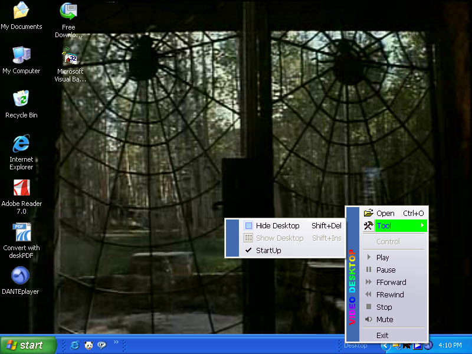



## VIDEO DESKTOP

### Description

This player just play video on Desktop ( Under Icon Desktop).This is just for relax and fun when you are bored to do something.

Basicly This player can run file multimedia like :qt,avi,mov,dat,snd,mpg,mpa,mpv,enc,m1v,mp2,mp3,mpe,mpeg,mpm,au,snd,aif,aiff,aifc,wav,wmv,wma,avi,midi,mid,rmi,cda and vob

and can run it in any place you want . You just modify some lines of code for do that. Some files multimedia need special codec that must be installed on your computer.

This program using only mci api and no ocx (except MSCOMCTL.OCX). Dependency File of this program are:msvbvm60.dll,oleaut32.dll,olepro32.dll,asycfilt.dll,stdole2.tlb,COMCAT.DLL,MSCOMCTL.OCX
 
### More Info
 

             |
---                |---
**Submitted On**   |2005-08-28 23:20:36
**By**             |[joko mulyono](https://github.com/Planet-Source-Code/PSCIndex/blob/master/ByAuthor/joko-mulyono.md)
**Level**          |Intermediate
**User Rating**    |5.0 (75 globes from 15 users)
**Compatibility**  |VB 5\.0, VB 6\.0
**Category**       |[Complete Applications](https://github.com/Planet-Source-Code/PSCIndex/blob/master/ByCategory/complete-applications__1-27.md)
**World**          |[Visual Basic](https://github.com/Planet-Source-Code/PSCIndex/blob/master/ByWorld/visual-basic.md)
**Archive File**   |[VIDEO\_DESK1928308292005\.zip](https://github.com/Planet-Source-Code/joko-mulyono-video-desktop__1-62369/archive/master.zip)

